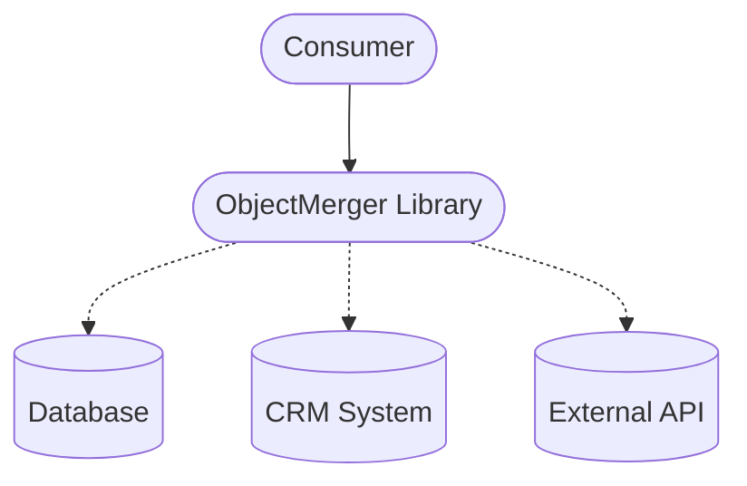

# ObjectMerger


> **Note**: This documentation follows the [arc42](https://arc42.org/) template structure.

## 1. Introduction and Goals

**ObjectMerger** is a Java library designed for the **configurable, strategy-based** merging and consolidation of object data from multiple sources (e.g., databases, external APIs, legacy systems). It solves the problem of creating a single, cohesive "Golden Record" from scattered data fragments by using configurable strategies to resolve conflicts and combine values.

This library is particularly useful in environments where data is distributed across multiple systems (e.g., a CRM, an ERP, and a bespoke internal application) and needs to be unified for consumption.

### 1.1 Goals
*   **Data Consolidation**: Create a single view of an object from multiple heterogeneous data sources.
*   **Conflict Resolution**: Automatically resolve conflicting data based on priorities or rules.
*   **Flexibility**: Support various merge strategies (priority, numeric aggregation, concatenation) adjustable via configuration.
*   **Extensibility**: Allow custom strategies via Java SPI.

### 1.2 Key Features
*   **Priority-based Selection**: Source A beats Source B (e.g., "Master Data" overrides "Cache").
*   **Numeric Aggregation**: Min, Max, Average, Sum.
*   **String Manipulation**: Concatenation of values.
*   **Complex Types**: Deep merging of Lists and Maps.
*   **Map Template Logic**: Leading map determines keys (controlled merges).
*   **High Performance**: Uses caching for Reflection operations to minimize overhead.

## 2. Constraints

*   **Language**: Java 21 (LTS)
*   **Build System**: Maven 3.8+
*   **License**: MIT

## 3. Context and Scope

ObjectMerger is used in environments where data is distributed across multiple systems or APIs.



*   **ObjectMerger Library**: The core logic that performs the merging.
*   **Integration**: Can be embedded in any Java application (CLI, REST API, Batch Job).

> **Note**: This repository includes a **CLI** and a **Spring Boot Application** as usage examples / reference implementations.

## 4. Solution Strategy

The core concept relies on **Strategies** and **Definitions**.

1.  **Labeled Sources**: Every data input is wrapped in a `LabeledSource` (e.g., source "database" contains Object A).
2.  **Field Definition**: Configuration defines how each field of the target object should be merged (e.g., `name` uses `priority`, `age` uses `maximum`).
3.  **Merge Process**: The `ObjectMerger` iterates over target fields, consults the definition, applies the corresponding `MergeStrategy`, and writes the result to the matching field.

### 4.1 Architecture
The library uses **Capability Interfaces** (e.g., `Prioritizable`, `ListConfig`) to define configuration requirements. Strategies depend on these interfaces rather than concrete configuration classes, enabling flexible composition.

## 5. Building Block View

The project is structured as a multi-module Maven project.

| Module | Description | Dependency |
|---|---|---|
| **objectmerger** | **Core library**. Contains the merge logic and standard strategies. | - |
| **objectmerger-cli** | *Example*: Command-line interface for file-based JSON merging. | `objectmerger`, `objectmerger-graaljs` or `objectmerger-mvel` |
| **objectmerger-spring-boot** | *Example*: REST API application with Swagger UI. | `objectmerger`, `objectmerger-graaljs` or `objectmerger-mvel` |
| **objectmerger-mvel** | **Extension**. MVEL-based scripting and conditional implementations. | `objectmerger`, `mvel2` |
| **objectmerger-graaljs** | **Extension**. GraalJS-based scripting and conditional implementations. | `objectmerger`, `graalvm` |

### 5.1 Level 1: Core Library (Whitebox)

The `objectmerger` module contains the business logic.

*   `ObjectMerger`: Main entry point (Facade). Delegates to engines.
*   `engine.PojoMerger`: Core logic for merging generic Java Objects.
*   `engine.MapMerger`: Core logic for merging Maps.
*   `MergeStrategy<T>`: Interface for all strategies.
*   `FieldDefinition`: POJO holding the configuration for a field.
*   `de.x132.objectmerger.strategy.*`: Implementation of strategies (Priority, Min, Max, etc.).

## 6. Runtime View

### 6.1 Using the Java Library

```java
// 1. Definition
MergeDefinition definition = loadMergeDefinition();

// 2. Sources
LabeledSource<Product> dbDetails = new LabeledSource<>("database", product1);
LabeledSource<Product> apiDetails = new LabeledSource<>("api", product2);

// 3. Merge
Product merged = ObjectMerger.merge(
    Product.class,
    definition,
    dbDetails,
    apiDetails
);

// 3a. Merge (Map-Based / Dynamic)
Map<String, Object> mergedMap = ObjectMerger.merge(
    definition,
    new LabeledSource<>("db", map1),
    new LabeledSource<>("api", map2)
);
```

### 6.2 Using the CLI

```bash
java -jar objectmerger-cli.jar \
  --target-class de.x132.cli.Person \
  --definition definition.json \
  --source database=db.json \
  --source crm=crm.json \
  --output merged.json
```

### 6.3 Using the REST API

POST to `http://localhost:8080/api/v1/merge` with a JSON body containing target class, definition, and source data.

## 7. Deployment View

### 7.1 Maven Dependency (Core)
```xml
<dependency>
    <groupId>de.x132</groupId>
    <artifactId>objectmerger</artifactId>
    <version>0.2.0</version>
</dependency>
```

### 7.2 Extensions (Select One)
ObjectMerger offers two scripting extensions. Please choose **one** based on your preferred scripting language.

#### Option A: MVEL Extension (Default / Classic)
Recommended for users familiar with Java-like syntax and the original behavior.
```xml
<dependency>
    <groupId>de.x132</groupId>
    <artifactId>objectmerger-mvel</artifactId>
    <version>0.2.0</version>
</dependency>
```

#### Option B: GraalJS Extension (Modern / JavaScript)
Recommended for users who prefer JavaScript syntax or require modern ECMA script features.
```xml
<dependency>
    <groupId>de.x132</groupId>
    <artifactId>objectmerger-graaljs</artifactId>
    <version>0.2.0</version>
</dependency>
```

> **Important**: Do not include both extensions simultaneously to avoid conflicts with the `conditional` strategy.

### 7.3 Build

```bash
mvn clean install
```
This builds all modules. The resulting artifacts are located in `target/` of the respective modules.

## 8. Cross-cutting Concepts

### 8.1 Merge Strategies

| Strategy | Description | configuration example |
|---|---|---|
| **priority** | Selects value from highest priority source. | `{"priority": {"db": 1, "api": 2}}` |
| **minimum** | Smallest value (Number, Date, String, etc.). | `{"strategy": "minimum"}` |
| **maximum** | Largest value (Number, Date, String, etc.). | `{"strategy": "maximum"}` |
| **average** | Average of all numeric values. | `{"strategy": "average"}` |
| **sum** | Sum of all numeric values. | `{"strategy": "sum"}` |
| **concatenate**| Joins strings. | `{"strategy": "concatenate"}` |
| **mergeList** | Merges lists by ID. Supports Template/Intersection. | `{"strategy": "mergeList", "identifyBy": "id", "keyOriginLabels": ["A"], "requirePresenceInAllKeyOrigins": true}` |
| **mergeMap** | Vereinigt Maps (Union oder Template) | `{"strategy": "mergeMap"}` |
| **nested**| Deep merge of POJOs using nested definition. | `{"strategy": "nested", "nestedDefinition": {...}}` |
| **mvel** | Execute custom MVEL scripts. | `{"strategy": "mvel", "expression": "return 1;"}` |
| **graaljs** | Execute custom JavaScript scripts. | `{"strategy": "graaljs", "expression": "1 + 1"}` |

### 8.2 Map Template Logic
Vereinigt Map-Objekte aus mehreren Quellen.

*   **Standard (Union)**: Keys aus **allen** Quellen werden vereinigt.
*   **Template Mode**: Wenn `keyTemplateSources` definiert ist, werden nur Keys aus diesen Quellen verwendet.

```json
{
  "settings": {
    "strategy": "mergeMap",
    "keyTemplateSources": ["source1"]
  }
```

### 8.3 List Template Logic
Control which items are retained in the merged list.

*   **Standard (Union)**: Items from **all** sources are merged.
*   **Template Mode**: If `keyOriginLabels` is set, only items originating from these sources are retained.
*   **Intersection**: If `requirePresenceInAllKeyOrigins` is true, items must be present in ALL specified key origin sources.

```json
{
  "items": {
    "strategy": "mergeList",
    "identifyBy": "id",
    "keyOriginLabels": ["sourceA", "sourceB"],
    "requirePresenceInAllKeyOrigins": true
  }
}
```

### 8.4 Scripting
You can choose between **MVEL** and **GraalJS** backends depending on your included dependencies.

#### 8.4.1 MVEL Scripting
Allows complex logic using [MVEL](http://mvel.documentnode.com/).

**Context Variables:**
* `sources`: `Map<String, Object>` (Label -> Object)
* `labeledSources`: `List<LabeledSource>`

**Example:**
```json
{
  "age": {
    "strategy": "mvel",
    "expression": "java.util.Collections.max(sources.values().!=[null].!=[age==null].age)"
  }
}
```

#### 8.4.2 JavaScript Scripting (GraalJS)
Allows complex logic using JavaScript (via GraalVM Polyglot).

**Context Variables:**
* `sources`: `Map<String, Object>` (Label -> Object) -> Accessible via `sources.get("label")` or `sources["label"]`
* `labeledSources`: `List<LabeledSource>`

**Example:**
```json
{
  "age": {
    "strategy": "graaljs",
    "expression": "var max = 0; for(var key in sources) { var s = sources[key]; if(s.age > max) max = s.age; }; max;"
  }
}
```

### 8.5 Conditional Strategy
The `conditional` strategy acts as a wrapper that routes to different strategies based on dynamic conditions. The implementation depends on the **chosen extension**:

*   If `objectmerger-mvel` is included -> Uses MVEL syntax.
*   If `objectmerger-graaljs` is included -> Uses JavaScript syntax.

**Note:** Ensure only **one** extension is active to avoid conflicts.

**Behavior:**
1.  Evaluates `cases` in order.
2.  If `condition` evaluates to `true`, executes `useStrategy`.
3.  If no case matches, executes `defaultStrategy`.

**Context Variables:**
- `sources`: List of available `LabeledSource` objects.
- `values`: Map of values for the current field (key = source label).

#### 8.5.1 Conditional (mvel)
Requires `objectmerger-mvel`. Uses MVEL syntax.

**Example:**
```json
{
  "field": "status",
  "strategy": "conditional",
  "cases": [
    {
      "condition": "values.containsKey('master') && values.get('master') == 'active'", 
      "useStrategy": { "strategy": "priority", "priority": {"master": 1} }
    }
  ],
  "defaultStrategy": { "strategy": "majority" }
}
```

#### 8.5.2 Conditional (graaljs)
Requires `objectmerger-graaljs`. Uses JavaScript syntax.

**Example:**
```json
{
  "field": "status",
  "strategy": "conditional",
  "cases": [
    {
      "condition": "values.get('master') == 'active'", 
      "useStrategy": { "strategy": "priority", "priority": {"master": 1} }
    }
  ],
  "defaultStrategy": { "strategy": "majority" }
}
```

### 8.6 Nested POJO Merging
Allows deep merging of nested POJO objects instead of replacing them wholesale. This enables granular control over nested fields.

**Configuration:**
- `strategy`: "nested"
- `nestedDefinition`: A full `MergeDefinition` for the nested object.

**Example:**
```json
{
  "address": {
    "strategy": "nested",
    "nestedDefinition": {
      "definitions": {
        "street": { "strategy": "priority", "priority": {"api": 1} },
        "zip": { "strategy": "priority", "priority": {"db": 1} }
      }
    }
  }
}
```

### 8.7 Synergy: Conditional + Nested
Combine strategies to validate data before deep merging.

**Example:**
```json
{
  "address": {
    "strategy": "conditional",
    "cases": [
      {
        "condition": "values.get('api') && values.get('api').isValid == true",
        "useStrategy": {
          "strategy": "nested",
          "nestedDefinition": {
            "templateSourceLabel": "api",
            "definitions": {
               "street": { "strategy": "priority", "priority": {"api": 1} }
            }
          }
        }
      }
    ],
    "defaultStrategy": { "strategy": "priority", "priority": {"db": 1} }
  }
}
```
## 9. Glossary

| Term | Definition |
|---|---|
| **LabeledSource** | A wrapper around a data object that assigns it a name (Label), e.g., "database". |
| **MergeDefinition** | A configuration object (usually from JSON/YAML) telling the merger how to handle each field. |
| **FieldDefinition** | Part of MergeDefinition, specific to one field. |
| **Strategy** | An algorithm implementing `MergeStrategy` to combine a list of values into one result. |
